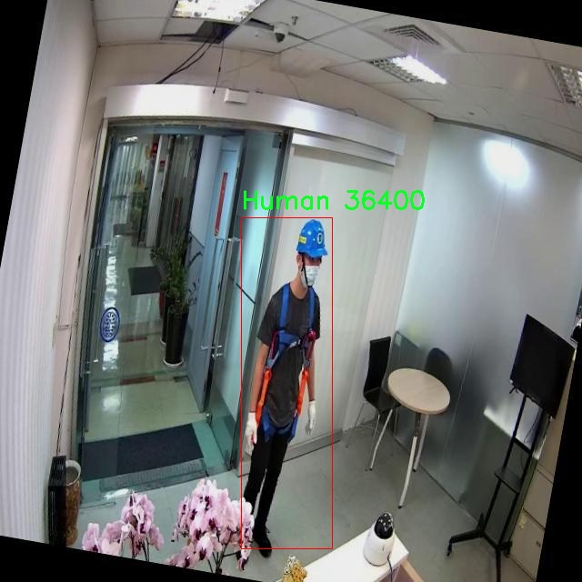

# 天线检测与目标识别检测系统源码分享
 # [一条龙教学YOLOV8标注好的数据集一键训练_70+全套改进创新点发刊_Web前端展示]

### 1.研究背景与意义

项目参考[AAAI Association for the Advancement of Artificial Intelligence](https://gitee.com/qunshansj/projects)

项目来源[AACV Association for the Advancement of Computer Vision](https://gitee.com/qunmasj/projects)

研究背景与意义

随着无线通信技术的迅猛发展，天线作为无线信号传输和接收的关键组件，其检测与识别的重要性日益凸显。传统的天线检测方法多依赖于人工巡检和经验判断，效率低下且容易受到人为因素的影响，难以满足现代通信网络对高效、精准检测的需求。因此，基于计算机视觉的自动化天线检测与目标识别系统应运而生，成为提升天线管理与维护效率的重要手段。

在这一背景下，YOLO（You Only Look Once）系列目标检测算法因其优越的实时性和高准确率而广泛应用于各类目标检测任务。YOLOv8作为该系列的最新版本，进一步优化了模型结构和训练策略，能够在复杂环境中实现高效的目标检测。通过对YOLOv8的改进，我们可以更好地适应天线检测的特定需求，提升模型在不同场景下的鲁棒性和准确性。

本研究所使用的数据集包含3457张图像，涵盖了三类目标：天线、人类和其他目标。这一数据集的构建为模型的训练和验证提供了丰富的样本支持，能够有效提升模型的泛化能力。尤其是在天线检测这一特定领域，数据集的多样性和代表性对于模型的性能至关重要。通过对不同类别目标的标注与分类，研究者能够更深入地分析天线与其他目标之间的关系，从而为后续的目标识别和场景理解提供更为全面的基础。

在技术层面，改进YOLOv8的天线检测与目标识别系统不仅能够提高检测的准确性，还能够实现实时监控和数据分析，为通信网络的维护提供科学依据。通过对天线状态的实时监测，运维人员可以及时发现潜在问题，降低故障率，提高网络的稳定性和可靠性。此外，该系统还可以应用于智能城市、无人驾驶等领域，为未来的智能化发展提供技术支持。

从社会意义上看，随着5G及未来6G技术的推广，天线的数量和种类将不断增加，传统的人工检测方式将难以满足日益增长的需求。基于改进YOLOv8的自动化检测系统能够有效缓解这一矛盾，推动通信行业的智能化转型。同时，该系统的成功应用也为其他领域的目标检测提供了借鉴，促进了计算机视觉技术的广泛应用与发展。

综上所述，基于改进YOLOv8的天线检测与目标识别系统的研究不仅具有重要的学术价值，也具备显著的应用前景。通过深入探讨该系统的设计与实现，我们期望能够为无线通信领域的智能化管理提供新的思路和解决方案，推动相关技术的不断进步与创新。

### 2.图片演示


##### 注意：由于此博客编辑较早，上面“2.图片演示”和“3.视频演示”展示的系统图片或者视频可能为老版本，新版本在老版本的基础上升级如下：（实际效果以升级的新版本为准）

  （1）适配了YOLOV8的“目标检测”模型和“实例分割”模型，通过加载相应的权重（.pt）文件即可自适应加载模型。

  （2）支持“图片识别”、“视频识别”、“摄像头实时识别”三种识别模式。

  （3）支持“图片识别”、“视频识别”、“摄像头实时识别”三种识别结果保存导出，解决手动导出（容易卡顿出现爆内存）存在的问题，识别完自动保存结果并导出到tempDir中。

  （4）支持Web前端系统中的标题、背景图等自定义修改，后面提供修改教程。

  另外本项目提供训练的数据集和训练教程,暂不提供权重文件（best.pt）,需要您按照教程进行训练后实现图片演示和Web前端界面演示的效果。

### 3.视频演示

[3.1 视频演示](https://www.bilibili.com/video/BV12P4heRErS/)

### 4.数据集信息展示

##### 4.1 本项目数据集详细数据（类别数＆类别名）

nc: 3
names: ['Antenna', 'Human', 'Target']


##### 4.2 本项目数据集信息介绍

数据集信息展示

在现代计算机视觉领域，尤其是在目标检测与识别的研究中，数据集的质量和多样性直接影响到模型的性能和泛化能力。本研究所使用的数据集名为“Antenna”，其主要目的是为了改进YOLOv8在天线检测与目标识别方面的表现。该数据集包含三类重要的目标，分别是“天线”（Antenna）、“人类”（Human）和“目标”（Target），为模型提供了丰富的训练样本，以便其能够在复杂环境中有效识别和定位这些对象。

“Antenna”数据集的设计考虑到了现实世界中天线的多样性及其与其他目标的相互关系。数据集中包含的“天线”类别涵盖了不同类型和形状的天线，如全向天线、定向天线和微波天线等。这些天线在不同的环境中可能会有不同的外观特征，因此数据集中的样本在拍摄时尽量涵盖了多种光照条件、背景和角度，以增强模型的鲁棒性。

“人类”类别则是为了确保系统能够在复杂场景中区分人类与其他目标。该类别中的样本包括了不同姿态、服装和活动状态的人类图像，这对于提升模型在实际应用中的准确性至关重要。通过引入人类目标，研究者可以确保系统在天线周围的人类活动中保持高效的检测能力，从而在诸如安防监控、智能交通等领域中发挥更大的作用。

最后，“目标”类别则是一个相对广泛的分类，涵盖了与天线相关的其他物体，例如电缆、支架和信号发射器等。这一类别的引入使得模型不仅能够识别天线本身，还能够理解其周围环境中可能影响其功能的其他物体。这种综合的目标识别能力使得系统在处理复杂场景时更加灵活，能够提供更为全面的环境理解。

为了确保数据集的有效性和实用性，所有样本均经过严格的标注和筛选，确保每个类别的样本数量均衡，且标注准确。这种高质量的标注不仅提高了模型训练的效率，也为后续的模型评估提供了可靠的基准。数据集的构建过程还考虑到了数据的多样性和代表性，力求涵盖各种可能的场景，以便模型能够在真实世界中展现出优异的性能。

综上所述，“Antenna”数据集不仅为YOLOv8的改进提供了坚实的基础，也为未来在天线检测与目标识别领域的研究提供了宝贵的资源。通过对这三类目标的深入学习和理解，研究者们希望能够推动计算机视觉技术的发展，使其在实际应用中更加高效和可靠。





### 5.全套项目环境部署视频教程（零基础手把手教学）

[5.1 环境部署教程链接（零基础手把手教学）](https://www.ixigua.com/7404473917358506534?logTag=c807d0cbc21c0ef59de5)


[5.2 安装Python虚拟环境创建和依赖库安装视频教程链接（零基础手把手教学）](https://www.ixigua.com/7404474678003106304?logTag=1f1041108cd1f708b01a)

### 6.手把手YOLOV8训练视频教程（零基础小白有手就能学会）

[6.1 手把手YOLOV8训练视频教程（零基础小白有手就能学会）](https://www.ixigua.com/7404477157818401292?logTag=d31a2dfd1983c9668658)

### 7.70+种全套YOLOV8创新点代码加载调参视频教程（一键加载写好的改进模型的配置文件）

[7.1 70+种全套YOLOV8创新点代码加载调参视频教程（一键加载写好的改进模型的配置文件）](https://www.ixigua.com/7404478314661806627?logTag=29066f8288e3f4eea3a4)

### 8.70+种全套YOLOV8创新点原理讲解（非科班也可以轻松写刊发刊，V10版本正在科研待更新）

由于篇幅限制，每个创新点的具体原理讲解就不一一展开，具体见下列网址中的创新点对应子项目的技术原理博客网址【Blog】：


[8.1 70+种全套YOLOV8创新点原理讲解链接](https://gitee.com/qunmasj/good)

### 9.系统功能展示（检测对象为举例，实际内容以本项目数据集为准）

图9.1.系统支持检测结果表格显示

  图9.2.系统支持置信度和IOU阈值手动调节

  图9.3.系统支持自定义加载权重文件best.pt(需要你通过步骤5中训练获得)

  图9.4.系统支持摄像头实时识别

  图9.5.系统支持图片识别

  图9.6.系统支持视频识别

  图9.7.系统支持识别结果文件自动保存

  图9.8.系统支持Excel导出检测结果数据


### 10.原始YOLOV8算法原理

原始YOLOv8算法原理

YOLOv8（You Only Look Once version 8）作为YOLO系列中的最新版本，自2023年初由Ultralytics团队提出以来，迅速成为目标检测领域的一个重要里程碑。相较于其前辈，YOLOv8在多个方面进行了显著的改进，使其在速度、精度和可训练性等方面表现得更加出色。YOLOv8的设计理念依然遵循了YOLO系列一贯的高效性和实时性，但在具体的网络结构和算法实现上，进行了深入的创新和优化。

YOLOv8的网络结构主要由四个部分组成：输入端、骨干网络（Backbone）、颈部网络（Neck）和头部网络（Head）。输入端采用了马赛克数据增强技术，这种方法通过将多张图像拼接在一起，增强了模型的鲁棒性和泛化能力。然而，YOLOv8在训练的最后10个epoch中停止使用马赛克数据增强，以避免对数据真实分布的干扰，从而使模型能够更好地学习有效的特征。

在骨干网络部分，YOLOv8引入了C2f模块，取代了之前版本中的C3模块。C2f模块的设计灵感来源于YOLOv7的ELAN结构，通过增加更多的分支和跨层连接，显著增强了模型的梯度流动性。这种结构的变化使得网络能够更有效地学习和提取特征，从而提升了特征表示能力。此外，YOLOv8依然保留了空间金字塔池化融合（SPPF）结构，这一结构在保持效果的同时，减少了执行时间，进一步提高了模型的效率。

颈部网络采用了路径聚合网络（PAN）结构，这一设计旨在增强网络对不同尺度对象的特征融合能力。通过有效地整合来自不同层次的特征，YOLOv8能够更好地处理各种尺寸的目标，提高了检测的准确性。

头部网络的设计是YOLOv8的一大亮点。与之前版本的耦合头结构不同，YOLOv8采用了解耦头结构，将分类和检测过程分为两个并行的分支。这种分离的设计使得分类任务和定位任务能够独立优化，分别关注特征图中的类别相似性和边界框与真实框之间的位置关系，从而提升了模型的收敛速度和预测精度。此外，YOLOv8还引入了无锚框检测头，直接预测目标的中心位置，减少了锚框预测的数量，这不仅加速了非最大抑制（NMS）过程，还降低了模型的复杂性。

在损失计算方面，YOLOv8采用了任务对齐学习（Task Alignment Learning，TAL）策略，通过结合分类分数和交并比（IoU）的高次幂乘积，来衡量任务的对齐程度。这一创新的损失计算方法使得模型在分类和定位任务中都能获得更好的性能，确保了模型在实际应用中的可靠性。

YOLOv8的模型设置灵活多样，提供了n、s、m、l、x五种不同尺寸的模型，以适应不同的应用场景。特别是YOLOv8n版本，以其最小的参数量和最快的检测速度，成为了许多实时应用的首选。通过调整深度因子、宽度因子和通道数等参数，用户可以根据需求对模型进行个性化设置，从而在保持高精度的同时，确保模型的实时性和可控性。

YOLOv8在多个公开数据集上的表现均优于其前辈，尤其是在COCO数据集上，其mAP（mean Average Precision）指标显示出显著的提升。这表明，YOLOv8不仅在理论上进行了优化，更在实际应用中展现了其强大的性能。通过对模型结构的精简和优化，YOLOv8在保持高精度的同时，显著提高了推理速度，使其成为了目标检测领域的一个重要工具。

总的来说，YOLOv8通过一系列创新的设计和优化，不仅提升了目标检测的精度和速度，还增强了模型的可训练性和适应性。这些改进使得YOLOv8在实际应用中表现出色，尤其适合于需要实时处理和高准确率的场景，如自动驾驶、视频监控和智能机器人等领域。随着YOLOv8的广泛应用，其在目标检测领域的影响力将进一步扩大，推动相关技术的不断进步与发展。


### 11.项目核心源码讲解（再也不用担心看不懂代码逻辑）

#### 11.1 code\ultralytics\models\nas\predict.py

以下是对代码的核心部分进行提炼和详细注释的结果：

```python
# 导入必要的库
import torch
from ultralytics.engine.predictor import BasePredictor
from ultralytics.engine.results import Results
from ultralytics.utils import ops

class NASPredictor(BasePredictor):
    """
    Ultralytics YOLO NAS 预测器，用于目标检测。

    该类扩展了 Ultralytics 引擎中的 `BasePredictor`，负责对 YOLO NAS 模型生成的原始预测结果进行后处理。
    它应用了非极大值抑制（NMS）等操作，并将边界框缩放以适应原始图像的尺寸。

    属性:
        args (Namespace): 包含各种后处理配置的命名空间。

    示例:
        ```python
        from ultralytics import NAS

        model = NAS('yolo_nas_s')
        predictor = model.predictor
        # 假设 raw_preds, img, orig_imgs 可用
        results = predictor.postprocess(raw_preds, img, orig_imgs)
        ```

    注意:
        通常情况下，该类不会被直接实例化，而是在 `NAS` 类内部使用。
    """

    def postprocess(self, preds_in, img, orig_imgs):
        """对预测结果进行后处理，并返回 Results 对象的列表。"""

        # 将预测框从 xyxy 格式转换为 xywh 格式，并拼接类分数
        boxes = ops.xyxy2xywh(preds_in[0][0])  # 获取边界框
        preds = torch.cat((boxes, preds_in[0][1]), -1).permute(0, 2, 1)  # 拼接边界框和类分数

        # 应用非极大值抑制，过滤掉冗余的检测框
        preds = ops.non_max_suppression(
            preds,
            self.args.conf,  # 置信度阈值
            self.args.iou,   # IOU 阈值
            agnostic=self.args.agnostic_nms,  # 是否对类别无关的 NMS
            max_det=self.args.max_det,  # 最大检测框数量
            classes=self.args.classes,   # 指定的类别
        )

        # 如果输入图像不是列表，则将其转换为 numpy 数组
        if not isinstance(orig_imgs, list):  # 输入图像是 torch.Tensor，而不是列表
            orig_imgs = ops.convert_torch2numpy_batch(orig_imgs)

        results = []  # 初始化结果列表
        for i, pred in enumerate(preds):  # 遍历每个预测结果
            orig_img = orig_imgs[i]  # 获取原始图像
            # 将边界框缩放到原始图像的尺寸
            pred[:, :4] = ops.scale_boxes(img.shape[2:], pred[:, :4], orig_img.shape)
            img_path = self.batch[0][i]  # 获取图像路径
            # 将结果存储到 Results 对象中
            results.append(Results(orig_img, path=img_path, names=self.model.names, boxes=pred))
        return results  # 返回结果列表
```

### 代码分析：
1. **类的定义**：`NASPredictor` 继承自 `BasePredictor`，用于处理 YOLO NAS 模型的预测结果。
2. **postprocess 方法**：这是该类的核心方法，负责将模型的原始预测结果进行后处理，包括：
   - 将边界框格式转换和拼接类分数。
   - 应用非极大值抑制（NMS）来去除冗余的检测框。
   - 将边界框缩放到原始图像的尺寸。
   - 返回处理后的结果列表，每个结果包含原始图像、路径、类别名称和边界框信息。

该文件是Ultralytics YOLO（You Only Look Once）NAS（Neural Architecture Search）模型的预测模块，主要用于对象检测。文件中定义了一个名为`NASPredictor`的类，它继承自`BasePredictor`，并负责对YOLO NAS模型生成的原始预测结果进行后处理。

在类的文档字符串中，说明了该类的功能和用途。`NASPredictor`类的主要职责是对模型的原始预测结果进行后处理，包括应用非极大值抑制（NMS）和将边界框缩放到原始图像的尺寸。类中包含一个名为`args`的属性，它是一个命名空间，包含了多种后处理的配置参数。

在示例代码中，展示了如何使用该预测器。首先，从`ultralytics`库中导入`NAS`类，创建一个YOLO NAS模型实例，并获取其预测器。然后，假设有原始预测结果`raw_preds`、输入图像`img`和原始图像`orig_imgs`，调用`postprocess`方法来处理这些预测结果。

`postprocess`方法是该类的核心功能。它接受三个参数：`preds_in`（原始预测结果）、`img`（输入图像）和`orig_imgs`（原始图像）。方法首先将预测框的坐标从xyxy格式转换为xywh格式，并将边界框和类分数合并。接着，调用`non_max_suppression`函数对合并后的预测结果进行非极大值抑制，以去除重叠的边界框。

在处理完预测结果后，方法检查输入的原始图像是否为列表格式，如果不是，则将其转换为NumPy数组格式。接下来，方法会遍历每个预测结果，缩放边界框以适应原始图像的尺寸，并将结果存储在`Results`对象中。最后，返回一个包含所有结果的列表。

总体来说，这个文件实现了YOLO NAS模型的后处理逻辑，确保模型的输出结果能够正确地映射到原始图像上，方便后续的结果分析和可视化。

#### 11.2 70+种YOLOv8算法改进源码大全和调试加载训练教程（非必要）\ultralytics\models\sam\modules\transformer.py

以下是经过简化并注释的核心代码部分，保留了主要的功能和结构。

```python
import math
import torch
from torch import Tensor, nn

class Attention(nn.Module):
    """实现注意力机制的类，支持对输入的查询、键和值进行投影和计算注意力。"""

    def __init__(self, embedding_dim: int, num_heads: int, downsample_rate: int = 1) -> None:
        """
        初始化注意力层。

        Args:
            embedding_dim (int): 输入嵌入的维度。
            num_heads (int): 注意力头的数量。
            downsample_rate (int): 内部维度的下采样因子，默认为1。
        """
        super().__init__()
        self.embedding_dim = embedding_dim
        self.internal_dim = embedding_dim // downsample_rate  # 计算内部维度
        self.num_heads = num_heads
        assert self.internal_dim % num_heads == 0, 'num_heads必须整除embedding_dim.'

        # 定义线性层用于查询、键和值的投影
        self.q_proj = nn.Linear(embedding_dim, self.internal_dim)
        self.k_proj = nn.Linear(embedding_dim, self.internal_dim)
        self.v_proj = nn.Linear(embedding_dim, self.internal_dim)
        self.out_proj = nn.Linear(self.internal_dim, embedding_dim)  # 输出投影

    @staticmethod
    def _separate_heads(x: Tensor, num_heads: int) -> Tensor:
        """将输入张量分离为指定数量的注意力头。"""
        b, n, c = x.shape  # b: 批量大小, n: 序列长度, c: 通道数
        x = x.reshape(b, n, num_heads, c // num_heads)  # 重塑为 (b, n, num_heads, c_per_head)
        return x.transpose(1, 2)  # 转置为 (b, num_heads, n, c_per_head)

    @staticmethod
    def _recombine_heads(x: Tensor) -> Tensor:
        """将分离的注意力头重新组合为单个张量。"""
        b, n_heads, n_tokens, c_per_head = x.shape
        x = x.transpose(1, 2)  # 转置为 (b, n_tokens, n_heads, c_per_head)
        return x.reshape(b, n_tokens, n_heads * c_per_head)  # 重塑为 (b, n_tokens, c)

    def forward(self, q: Tensor, k: Tensor, v: Tensor) -> Tensor:
        """计算给定查询、键和值的注意力输出。"""

        # 输入投影
        q = self.q_proj(q)  # 投影查询
        k = self.k_proj(k)  # 投影键
        v = self.v_proj(v)  # 投影值

        # 分离为多个头
        q = self._separate_heads(q, self.num_heads)
        k = self._separate_heads(k, self.num_heads)
        v = self._separate_heads(v, self.num_heads)

        # 计算注意力
        _, _, _, c_per_head = q.shape
        attn = q @ k.permute(0, 1, 3, 2)  # 计算注意力得分
        attn = attn / math.sqrt(c_per_head)  # 缩放
        attn = torch.softmax(attn, dim=-1)  # 应用softmax

        # 获取输出
        out = attn @ v  # 加权值
        out = self._recombine_heads(out)  # 重新组合头
        return self.out_proj(out)  # 输出投影

class TwoWayTransformer(nn.Module):
    """双向变换器模块，能够同时关注图像和查询点。"""

    def __init__(self, depth: int, embedding_dim: int, num_heads: int, mlp_dim: int) -> None:
        """
        初始化双向变换器。

        Args:
            depth (int): 变换器的层数。
            embedding_dim (int): 输入嵌入的通道维度。
            num_heads (int): 多头注意力的头数。
            mlp_dim (int): MLP块的内部通道维度。
        """
        super().__init__()
        self.depth = depth
        self.embedding_dim = embedding_dim
        self.num_heads = num_heads
        self.layers = nn.ModuleList()

        # 添加多个双向注意力块
        for _ in range(depth):
            self.layers.append(TwoWayAttentionBlock(embedding_dim, num_heads, mlp_dim))

        self.final_attn = Attention(embedding_dim, num_heads)  # 最终的注意力层
        self.norm_final_attn = nn.LayerNorm(embedding_dim)  # 最终层归一化

    def forward(self, image_embedding: Tensor, point_embedding: Tensor) -> Tuple[Tensor, Tensor]:
        """前向传播，处理图像和查询点的嵌入。"""

        # 处理图像嵌入
        bs, c, h, w = image_embedding.shape
        image_embedding = image_embedding.flatten(2).permute(0, 2, 1)  # 重塑为 (b, h*w, c)

        queries = point_embedding  # 查询点嵌入
        keys = image_embedding  # 图像嵌入

        # 通过每个层进行处理
        for layer in self.layers:
            queries, keys = layer(queries, keys)

        # 最终注意力层
        attn_out = self.final_attn(q=queries, k=keys, v=keys)
        queries = queries + attn_out  # 更新查询
        queries = self.norm_final_attn(queries)  # 归一化

        return queries, keys  # 返回处理后的查询和键
```

### 代码说明：
1. **Attention类**：实现了注意力机制，包括查询、键和值的投影，以及计算注意力输出的功能。
2. **TwoWayTransformer类**：构建了一个双向变换器，能够同时处理图像和查询点的嵌入。它包含多个注意力层和最终的注意力层，用于处理输入数据。
3. **forward方法**：在`Attention`和`TwoWayTransformer`类中，`forward`方法定义了数据流动的过程，处理输入并返回输出。

这个程序文件实现了一个名为 `TwoWayTransformer` 的双向变换器模块，主要用于图像处理任务，如目标检测、图像分割和点云处理。该模块能够同时关注图像和查询点，通过提供位置嵌入来实现对输入图像的注意力机制。

在 `TwoWayTransformer` 类的构造函数中，定义了一些关键参数，包括变换器的层数（`depth`）、输入嵌入的通道维度（`embedding_dim`）、多头注意力的头数（`num_heads`）、MLP块的内部通道维度（`mlp_dim`）等。通过循环创建多个 `TwoWayAttentionBlock` 层，这些层将构成变换器的主体。此外，还定义了最终的注意力层和层归一化操作。

在 `forward` 方法中，输入的图像嵌入和位置编码被展平并重新排列，以便进行后续的注意力计算。该方法接收图像嵌入、图像位置编码和查询点嵌入作为输入，经过多层注意力块的处理后，返回处理后的查询点嵌入和图像嵌入。

`TwoWayAttentionBlock` 类实现了一个注意力块，包含自注意力和交叉注意力的计算。它的构造函数定义了自注意力层、交叉注意力层、MLP块和多个层归一化操作。`forward` 方法依次执行自注意力、交叉注意力和MLP操作，最后返回处理后的查询和键。

`Attention` 类则实现了一个注意力层，支持在投影到查询、键和值之后对嵌入进行下采样。该类的构造函数初始化了输入嵌入的维度、注意力头的数量和下采样率，并定义了用于投影的线性层。在 `forward` 方法中，输入的查询、键和值被投影并分离成多个注意力头，计算注意力输出后再重新组合成一个张量。

整体来看，这个程序文件展示了如何构建一个复杂的双向变换器架构，通过自注意力和交叉注意力机制来处理图像和查询点之间的关系，适用于多种计算机视觉任务。

#### 11.3 ui.py

```python
import sys
import subprocess

def run_script(script_path):
    """
    使用当前 Python 环境运行指定的脚本。

    Args:
        script_path (str): 要运行的脚本路径

    Returns:
        None
    """
    # 获取当前 Python 解释器的路径
    python_path = sys.executable

    # 构建运行命令，使用 streamlit 运行指定的脚本
    command = f'"{python_path}" -m streamlit run "{script_path}"'

    # 执行命令并等待其完成
    result = subprocess.run(command, shell=True)
    
    # 检查命令执行的返回码，如果不为0则表示出错
    if result.returncode != 0:
        print("脚本运行出错。")

# 实例化并运行应用
if __name__ == "__main__":
    # 指定要运行的脚本路径
    script_path = "web.py"  # 这里可以直接指定脚本名称

    # 调用函数运行脚本
    run_script(script_path)
```

### 代码核心部分说明：
1. **导入模块**：
   - `sys`：用于获取当前 Python 解释器的路径。
   - `subprocess`：用于执行外部命令。

2. **`run_script` 函数**：
   - 该函数接收一个脚本路径作为参数，并使用当前 Python 环境运行该脚本。
   - 使用 `sys.executable` 获取当前 Python 解释器的路径。
   - 构建命令字符串，使用 `streamlit` 模块运行指定的脚本。
   - 使用 `subprocess.run` 执行命令，并检查返回码以判断脚本是否成功运行。

3. **主程序入口**：
   - 在 `if __name__ == "__main__":` 块中，指定要运行的脚本路径（此处为 `"web.py"`）。
   - 调用 `run_script` 函数来执行该脚本。

这个程序文件的主要功能是使用当前的 Python 环境来运行一个指定的脚本，具体是通过 Streamlit 来启动一个 Web 应用。程序首先导入了必要的模块，包括 `sys`、`os` 和 `subprocess`，这些模块提供了与系统交互的功能。特别地，`sys` 模块用于获取当前 Python 解释器的路径，`subprocess` 模块用于执行外部命令。

在文件中定义了一个名为 `run_script` 的函数，该函数接受一个参数 `script_path`，表示要运行的脚本的路径。函数内部首先获取当前 Python 解释器的路径，并构建一个命令字符串，该命令使用 Streamlit 来运行指定的脚本。命令的格式是 `python -m streamlit run "script_path"`，其中 `script_path` 是传入的参数。

接下来，使用 `subprocess.run` 方法执行构建好的命令。如果命令执行的返回码不为 0，表示脚本运行过程中出现了错误，程序会输出相应的错误信息。

在文件的最后部分，使用 `if __name__ == "__main__":` 语句来确保当该文件作为主程序运行时，以下代码才会被执行。这里指定了要运行的脚本路径为 `web.py`，并调用 `run_script` 函数来执行这个脚本。

总的来说，这个程序文件的作用是简化通过 Streamlit 启动 Web 应用的过程，确保用户可以方便地运行指定的 Python 脚本。

#### 11.4 code\ultralytics\models\fastsam\val.py

以下是代码中最核心的部分，并附上详细的中文注释：

```python
# 导入所需的类
from ultralytics.models.yolo.segment import SegmentationValidator
from ultralytics.utils.metrics import SegmentMetrics

class FastSAMValidator(SegmentationValidator):
    """
    自定义验证类，用于在Ultralytics YOLO框架中进行快速SAM（Segment Anything Model）分割。

    该类扩展了SegmentationValidator类，专门定制了快速SAM的验证过程。此类将任务设置为'分割'，
    并使用SegmentMetrics进行评估。此外，为了避免在验证过程中出现错误，禁用了绘图功能。
    """

    def __init__(self, dataloader=None, save_dir=None, pbar=None, args=None, _callbacks=None):
        """
        初始化FastSAMValidator类，将任务设置为'分割'，并将指标设置为SegmentMetrics。

        参数：
            dataloader (torch.utils.data.DataLoader): 用于验证的数据加载器。
            save_dir (Path, optional): 保存结果的目录。
            pbar (tqdm.tqdm): 用于显示进度的进度条。
            args (SimpleNamespace): 验证器的配置。
            _callbacks (dict): 用于存储各种回调函数的字典。

        注意：
            为了避免错误，在此类中禁用了ConfusionMatrix和其他相关指标的绘图功能。
        """
        # 调用父类的初始化方法
        super().__init__(dataloader, save_dir, pbar, args, _callbacks)
        # 设置任务类型为'分割'
        self.args.task = "segment"
        # 禁用绘图功能以避免错误
        self.args.plots = False  
        # 初始化分割指标
        self.metrics = SegmentMetrics(save_dir=self.save_dir, on_plot=self.on_plot)
```

### 代码核心部分说明：
1. **类定义**：`FastSAMValidator` 继承自 `SegmentationValidator`，用于实现快速SAM分割的验证逻辑。
2. **初始化方法**：`__init__` 方法中，设置了任务类型为“分割”，并禁用了绘图功能，以避免在验证过程中出现错误。
3. **指标初始化**：使用 `SegmentMetrics` 来评估分割结果，确保能够有效地计算和记录性能指标。

这个程序文件是一个用于快速分割模型（Fast SAM，Segment Anything Model）验证的自定义类，名为 `FastSAMValidator`，它继承自 `SegmentationValidator` 类，属于 Ultralytics YOLO 框架的一部分。该类的主要目的是定制验证过程，以适应快速分割模型的需求。

在类的文档字符串中，首先说明了该类的功能和用途。它将任务设置为“分割”，并使用 `SegmentMetrics` 进行评估。此外，为了避免在验证过程中出现错误，该类禁用了绘图功能。

构造函数 `__init__` 用于初始化 `FastSAMValidator` 类的实例。它接受多个参数，包括数据加载器（`dataloader`）、结果保存目录（`save_dir`）、进度条对象（`pbar`）、配置参数（`args`）以及回调函数的字典（`_callbacks`）。在构造函数中，首先调用父类的构造函数以初始化继承的属性。接着，将任务类型设置为“segment”，并禁用绘图功能，以避免在验证过程中出现与混淆矩阵等相关的错误。最后，实例化 `SegmentMetrics` 用于保存验证结果的度量。

总的来说，这个文件定义了一个专门用于快速分割模型验证的类，提供了必要的初始化和配置，确保在验证过程中能够顺利进行，同时避免了潜在的错误。

#### 11.5 70+种YOLOv8算法改进源码大全和调试加载训练教程（非必要）\ultralytics\engine\__init__.py

以下是对代码的核心部分进行提炼和详细注释的示例：

```python
# Ultralytics YOLO 🚀, AGPL-3.0 license

# 导入必要的库
import torch  # 导入PyTorch库，用于深度学习模型的构建和训练

# 定义YOLO模型类
class YOLO:
    def __init__(self, model_path):
        # 初始化YOLO模型
        self.model = torch.load(model_path)  # 加载预训练的YOLO模型

    def predict(self, image):
        # 对输入图像进行预测
        with torch.no_grad():  # 禁用梯度计算，以提高推理速度
            predictions = self.model(image)  # 使用模型对图像进行推理
        return predictions  # 返回预测结果

# 示例用法
if __name__ == "__main__":
    yolo_model = YOLO("path/to/model.pt")  # 创建YOLO模型实例
    image = torch.zeros((1, 3, 640, 640))  # 创建一个虚拟图像，尺寸为640x640
    results = yolo_model.predict(image)  # 对虚拟图像进行预测
    print(results)  # 输出预测结果
```

### 代码注释说明：

1. **导入库**：首先导入了`torch`库，这是一个流行的深度学习框架，用于构建和训练神经网络。

2. **YOLO类**：定义了一个`YOLO`类，用于封装YOLO模型的功能。

3. **初始化方法**：
   - `__init__`方法用于初始化YOLO模型实例，接受一个模型路径作为参数。
   - 使用`torch.load`函数加载预训练的YOLO模型。

4. **预测方法**：
   - `predict`方法用于对输入图像进行预测。
   - 使用`torch.no_grad()`上下文管理器禁用梯度计算，以提高推理速度和减少内存消耗。
   - 调用模型对图像进行推理，并返回预测结果。

5. **示例用法**：
   - 在`__main__`块中，创建YOLO模型的实例，并加载指定路径的模型。
   - 创建一个虚拟图像（全零张量），并调用`predict`方法进行预测。
   - 最后输出预测结果。

通过这些注释，可以更清晰地理解代码的功能和结构。

这个程序文件的开头部分包含了一条注释，说明了该文件属于Ultralytics YOLO项目，并且使用了AGPL-3.0许可证。Ultralytics YOLO是一个流行的目标检测算法，广泛应用于计算机视觉领域。AGPL-3.0许可证是一种开源许可证，允许用户自由使用、修改和分发软件，但要求在分发修改后的版本时也必须提供源代码。

虽然代码内容非常简短，仅包含一行注释，但这行注释表明了文件的归属和法律信息。通常，在一个项目的`__init__.py`文件中，可能会包含初始化模块的代码，或者定义一些重要的包级别的变量和函数。这个文件的存在使得Python能够将包含它的目录视为一个包，从而可以在其他模块中导入和使用。

总的来说，这个文件的主要作用是标识Ultralytics YOLO项目，并提供相关的许可证信息，确保用户了解使用该代码的法律条款。

#### 11.6 train.py

以下是经过简化并添加详细中文注释的核心代码部分：

```python
import random
import numpy as np
import torch.nn as nn
from ultralytics.data import build_dataloader, build_yolo_dataset
from ultralytics.engine.trainer import BaseTrainer
from ultralytics.models import yolo
from ultralytics.nn.tasks import DetectionModel
from ultralytics.utils import LOGGER, RANK
from ultralytics.utils.torch_utils import de_parallel, torch_distributed_zero_first

class DetectionTrainer(BaseTrainer):
    """
    基于检测模型的训练类，继承自BaseTrainer类。
    """

    def build_dataset(self, img_path, mode="train", batch=None):
        """
        构建YOLO数据集。

        参数:
            img_path (str): 包含图像的文件夹路径。
            mode (str): 模式，'train'表示训练模式，'val'表示验证模式。
            batch (int, optional): 批次大小，适用于'rect'模式。默认为None。
        """
        gs = max(int(de_parallel(self.model).stride.max() if self.model else 0), 32)  # 获取模型的最大步幅
        return build_yolo_dataset(self.args, img_path, batch, self.data, mode=mode, rect=mode == "val", stride=gs)

    def get_dataloader(self, dataset_path, batch_size=16, rank=0, mode="train"):
        """构造并返回数据加载器。"""
        assert mode in ["train", "val"]  # 确保模式合法
        with torch_distributed_zero_first(rank):  # 在分布式环境中初始化数据集
            dataset = self.build_dataset(dataset_path, mode, batch_size)  # 构建数据集
        shuffle = mode == "train"  # 训练模式下打乱数据
        workers = self.args.workers if mode == "train" else self.args.workers * 2  # 设置工作线程数
        return build_dataloader(dataset, batch_size, workers, shuffle, rank)  # 返回数据加载器

    def preprocess_batch(self, batch):
        """对图像批次进行预处理，包括缩放和转换为浮点数。"""
        batch["img"] = batch["img"].to(self.device, non_blocking=True).float() / 255  # 将图像转换为浮点数并归一化
        if self.args.multi_scale:  # 如果启用多尺度
            imgs = batch["img"]
            sz = (
                random.randrange(self.args.imgsz * 0.5, self.args.imgsz * 1.5 + self.stride)
                // self.stride
                * self.stride
            )  # 随机选择新的图像大小
            sf = sz / max(imgs.shape[2:])  # 计算缩放因子
            if sf != 1:
                ns = [
                    math.ceil(x * sf / self.stride) * self.stride for x in imgs.shape[2:]
                ]  # 计算新的形状
                imgs = nn.functional.interpolate(imgs, size=ns, mode="bilinear", align_corners=False)  # 进行插值缩放
            batch["img"] = imgs  # 更新批次图像
        return batch

    def get_model(self, cfg=None, weights=None, verbose=True):
        """返回YOLO检测模型。"""
        model = DetectionModel(cfg, nc=self.data["nc"], verbose=verbose and RANK == -1)  # 创建检测模型
        if weights:
            model.load(weights)  # 加载权重
        return model

    def plot_training_samples(self, batch, ni):
        """绘制带有注释的训练样本。"""
        plot_images(
            images=batch["img"],
            batch_idx=batch["batch_idx"],
            cls=batch["cls"].squeeze(-1),
            bboxes=batch["bboxes"],
            paths=batch["im_file"],
            fname=self.save_dir / f"train_batch{ni}.jpg",
            on_plot=self.on_plot,
        )

    def plot_metrics(self):
        """从CSV文件中绘制指标。"""
        plot_results(file=self.csv, on_plot=self.on_plot)  # 保存结果图
```

### 代码说明：
1. **DetectionTrainer类**：这是一个用于训练YOLO检测模型的类，继承自`BaseTrainer`。
2. **build_dataset方法**：根据给定的图像路径和模式构建YOLO数据集。
3. **get_dataloader方法**：构造数据加载器，确保在分布式训练中只初始化一次数据集。
4. **preprocess_batch方法**：对输入的图像批次进行预处理，包括归一化和可能的缩放。
5. **get_model方法**：返回一个YOLO检测模型，并可选择加载预训练权重。
6. **plot_training_samples方法**：绘制训练样本及其注释，用于可视化训练过程。
7. **plot_metrics方法**：从CSV文件中读取并绘制训练指标，帮助监控训练效果。

这个程序文件 `train.py` 是一个用于训练目标检测模型的代码，主要基于 YOLO（You Only Look Once）框架。代码中定义了一个名为 `DetectionTrainer` 的类，该类继承自 `BaseTrainer`，用于实现目标检测的训练过程。

在 `DetectionTrainer` 类中，首先定义了一个 `build_dataset` 方法，该方法用于构建 YOLO 数据集。它接收图像路径、模式（训练或验证）和批量大小作为参数，利用 `build_yolo_dataset` 函数来创建数据集，并根据模型的步幅（stride）来调整数据集的构建。

接着，`get_dataloader` 方法用于构建数据加载器。它根据传入的模式（训练或验证）来初始化数据集，并设置是否打乱数据的顺序。该方法还会根据训练模式的不同调整工作线程的数量。

`preprocess_batch` 方法负责对每个批次的图像进行预处理，包括将图像缩放到适当的大小并转换为浮点数格式。这里还实现了多尺度训练的功能，通过随机选择图像的大小来增强模型的鲁棒性。

`set_model_attributes` 方法用于设置模型的属性，包括类别数量和类别名称等。这样可以确保模型能够正确处理不同的类别。

`get_model` 方法用于返回一个 YOLO 检测模型，支持加载预训练权重。`get_validator` 方法则返回一个用于模型验证的 `DetectionValidator` 实例。

`label_loss_items` 方法用于返回一个包含训练损失项的字典，便于后续的损失监控和分析。`progress_string` 方法返回一个格式化的字符串，显示训练进度，包括当前的轮次、GPU 内存使用情况、损失值等信息。

`plot_training_samples` 方法用于绘制训练样本及其标注，便于可视化训练过程中的数据。最后，`plot_metrics` 和 `plot_training_labels` 方法分别用于绘制训练过程中的指标和标注，帮助用户更好地理解模型的训练效果。

总体来说，这个文件实现了一个完整的目标检测模型训练框架，涵盖了数据集构建、数据加载、模型设置、训练过程监控以及结果可视化等多个方面。

### 12.系统整体结构（节选）

### 整体功能和构架概括

该项目是一个基于YOLO（You Only Look Once）框架的计算机视觉工具，主要用于目标检测和图像分割任务。项目包含多个模块和文件，涵盖了从模型训练、验证到预测的完整流程。其架构设计灵活，允许用户根据需求进行模型的定制和扩展。

- **模型训练**：`train.py` 文件实现了目标检测模型的训练过程，包括数据集构建、数据加载、模型设置和训练监控。
- **模型验证**：`val.py` 文件专门用于验证快速分割模型的性能，确保模型在测试集上的表现。
- **预测功能**：`predict.py` 文件提供了对模型输出结果的后处理功能，应用非极大值抑制等技术来优化预测结果。
- **数据处理**：多个文件负责数据加载和处理，包括图像预处理和数据集构建。
- **UI界面**：`ui.py` 文件通过Streamlit提供了一个简单的用户界面，方便用户运行和测试模型。
- **模块化设计**：项目采用模块化设计，便于维护和扩展，支持多种YOLO模型的实现和使用。

### 文件功能整理表

| 文件路径                                                                                                   | 功能描述                                                                                       |
|----------------------------------------------------------------------------------------------------------|-----------------------------------------------------------------------------------------------|
| `code\ultralytics\models\nas\predict.py`                                                                 | 实现YOLO NAS模型的预测后处理，包括应用非极大值抑制和边界框缩放。                                   |
| `70+种YOLOv8算法改进源码大全和调试加载训练教程（非必要）\ultralytics\models\sam\modules\transformer.py` | 定义双向变换器，用于图像处理任务，支持自注意力和交叉注意力机制。                                   |
| `ui.py`                                                                                                  | 提供一个简单的用户界面，通过Streamlit运行指定的Python脚本。                                      |
| `code\ultralytics\models\fastsam\val.py`                                                                | 定义快速分割模型的验证类，专注于模型在验证集上的性能评估。                                        |
| `70+种YOLOv8算法改进源码大全和调试加载训练教程（非必要）\ultralytics\engine\__init__.py`                | 标识Ultralytics YOLO项目并提供许可证信息。                                                       |
| `train.py`                                                                                               | 实现目标检测模型的训练过程，包括数据集构建、数据加载、模型设置和训练监控。                        |
| `70+种YOLOv8算法改进源码大全和调试加载训练教程（非必要）\ultralytics\trackers\utils\matching.py`       | 提供用于目标跟踪的匹配算法，支持在检测结果中进行目标匹配。                                        |
| `70+种YOLOv8算法改进源码大全和调试加载训练教程（非必要）\ultralytics\data\loaders.py`                | 实现数据加载器，负责加载和预处理训练和验证数据集。                                               |
| `70+种YOLOv8算法改进源码大全和调试加载训练教程（非必要）\ultralytics\models\sam\modules\sam.py`       | 定义分割模型的主要结构和功能，负责模型的前向传播和输出。                                          |
| `70+种YOLOv8算法改进源码大全和调试加载训练教程（非必要）\ultralytics\nn\extra_modules\block.py`      | 实现神经网络中的额外模块，可能包括卷积层、激活函数等组件。                                        |
| `70+种YOLOv8算法改进源码大全和调试加载训练教程（非必要）\ultralytics\engine\validator.py`            | 定义验证器类，用于评估模型在测试集上的性能，包括计算指标和结果可视化。                             |
| `code\ultralytics\models\fastsam\model.py`                                                              | 定义快速分割模型的结构和功能，负责模型的初始化和前向传播。                                        |
| `70+种YOLOv8算法改进源码大全和调试加载训练教程（非必要）\ultralytics\models\nas\predict.py`          | 实现YOLO NAS模型的预测后处理，类似于第一行的描述，可能存在重复。                                   |

这个表格概述了每个文件的主要功能，帮助理解整个项目的结构和功能模块。

注意：由于此博客编辑较早，上面“11.项目核心源码讲解（再也不用担心看不懂代码逻辑）”中部分代码可能会优化升级，仅供参考学习，完整“训练源码”、“Web前端界面”和“70+种创新点源码”以“13.完整训练+Web前端界面+70+种创新点源码、数据集获取”的内容为准。

### 13.完整训练+Web前端界面+70+种创新点源码、数据集获取


# [下载链接：https://mbd.pub/o/bread/ZpuTmJxq](https://mbd.pub/o/bread/ZpuTmJxq)